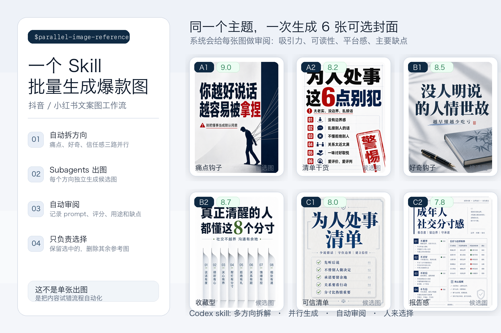
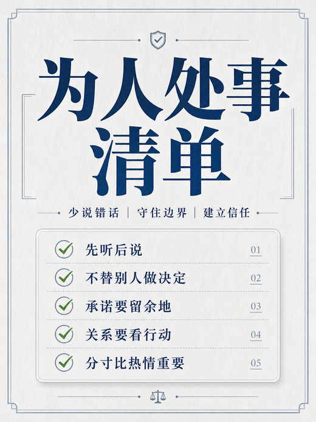
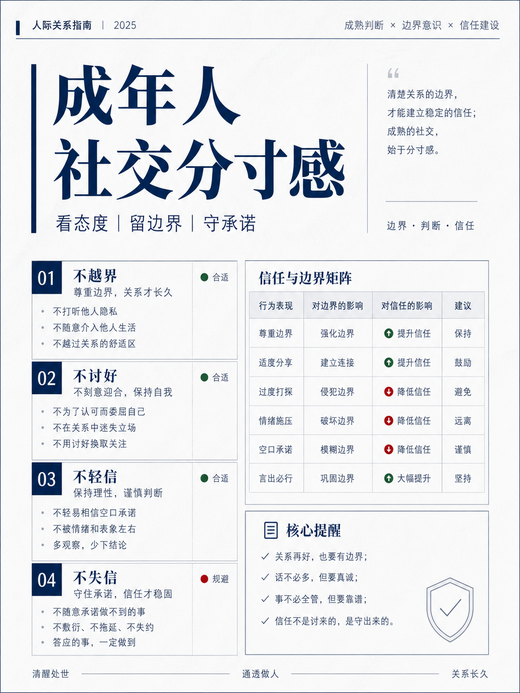

# Parallel Image References · 社媒爆款图批量生成 Skill

一个 Codex Skill，用来把“做一张小红书 / 抖音封面图”升级成一套可审阅的图片试错流程。

它不是只生成一张图，而是自动拆方向、并行出候选、记录 prompt、评分和缺点，最后让人来选择。



## 示例候选图

同一个主题可以一次生成多张不同方向的封面图，再由 Codex 自动审阅和打分。

| A1 痛点钩子 | A2 清单干货 | B1 好奇钩子 |
| --- | --- | --- |
|  |  |  |

| B2 收藏型 | C1 可信清单 | C2 报告感 |
| --- | --- | --- |
|  |  |  |

## 效果

- 一次生成 6 张社媒封面候选图
- 默认拆成 3 个方向：痛点钩子 / 好奇钩子 / 信任感钩子
- 多个 subagent 并行生成，减少等待和反复试 prompt
- 每张图自动记录 prompt、评分、适合用途、主要缺点
- 自动生成 `manifest.md`，方便复盘和二次筛选
- 只输出图片，不生成代码、不做网页、不复刻 UI

默认参数：

| 项目 | 默认值 |
| --- | --- |
| 候选图数量 | 6 张 |
| 方向数量 | 3 个 |
| 每个方向 | 2 张 |
| 小红书比例 | 3:4 或 4:5 |
| 抖音封面比例 | 9:16 |
| 单次上限 | 8 张，除非明确要求更多 |

## 适合 / 不适合

✅ 合适：

- 小红书封面图
- 抖音短视频封面
- 爆款文案海报
- 知识卡片
- 产品种草图
- 朋友圈 / 社群传播图
- 想一次看多个视觉方向，再人工挑选

❌ 不合适：

- 只想生成一张最终图
- 需要稳定还原大量精确文字的排版图
- 网站、App、前端页面实现
- SVG / icon / logo 这类更适合矢量或代码生成的内容
- 把选中图片复刻成代码

## 安装

### 方式一：手动安装

```bash
mkdir -p ~/.codex/skills
git clone https://github.com/Alex-3336/parallel-image-references.git ~/.codex/skills/parallel-image-references
```

### 方式二：更新已有版本

```bash
cd ~/.codex/skills/parallel-image-references
git pull
```

如果你想重新安装：

```bash
rm -rf ~/.codex/skills/parallel-image-references
git clone https://github.com/Alex-3336/parallel-image-references.git ~/.codex/skills/parallel-image-references
```

### 方式三：把这段话发给 Codex

```text
帮我安装 parallel-image-references 这个 Codex skill。
请执行：
1. 确保 ~/.codex/skills 存在
2. clone https://github.com/Alex-3336/parallel-image-references 到 ~/.codex/skills/parallel-image-references
3. 验证目录里有 SKILL.md 和 agents/openai.yaml
4. 告诉我安装完成
```

## 触发方式

安装后，在 Codex 里这样说：

```text
Use $parallel-image-references 给我生成 6 张小红书爆款文案封面图，主题是 AI 副业。
```

也可以直接说：

- “生成 6 张小红书爆款封面图，帮我审阅哪张最好”
- “做一组抖音封面候选图，主题是普通人如何用 AI 做内容”
- “这个标题做 6 个不同风格的社媒图，我要挑一张发”
- “帮我批量生成文案海报，并给每张图打分”

## 示例

### 示例一：小红书封面

```text
Use $parallel-image-references 给我生成 6 张小红书爆款文案封面图，主题是 AI 副业，风格要像收藏型干货。
```

适合输出：

- 痛点型：普通人做 AI 副业，最容易踩的 3 个坑
- 好奇型：为什么你用 AI 很久，还是赚不到钱
- 信任型：AI 副业冷启动清单

### 示例二：抖音封面

```text
Use $parallel-image-references 给我生成 6 张抖音封面图，主题是普通人如何用 AI 做内容，风格要强痛点、高对比、手机上快速扫到。
```

适合输出：

- 大字标题
- 高对比背景
- 单一强焦点
- 9:16 竖版封面

### 示例三：指定精确标题

```text
Use $parallel-image-references 给我生成小红书封面图，标题必须是「别再这样用 AI 写文案了」，做 6 个不同方向。
```

注意：如果图片里的中文明显错误，需要重新生成对应候选图。

## 使用流程

Skill 会按下面的方式工作：

1. 判断平台：小红书、抖音或两者都要
2. 拆分方向：痛点、好奇、信任感
3. 开多个 subagent 并行生成候选图
4. 保存图片到本地目录
5. 为每张图记录 prompt 和审阅结果
6. 给出候选图列表，让你选择保留哪张

## 输出结构

```text
image_references/<主题>-<时间>/
├── manifest.md
├── A-pain-point/
│   ├── candidate-A1.png
│   └── candidate-A2.png
├── B-curiosity/
│   ├── candidate-B1.png
│   └── candidate-B2.png
└── C-trust/
    ├── candidate-C1.png
    └── candidate-C2.png
```

`manifest.md` 会记录：

| 字段 | 含义 |
| --- | --- |
| ID | 候选图编号 |
| Direction | 图片方向 |
| File | 本地文件路径 |
| Platform | 平台和比例 |
| Prompt | 生成提示词摘要 |
| Score | 审阅评分 |
| Best Use | 最适合的使用方式 |
| Main Flaw | 主要缺点 |

## 审阅标准

每张图按 1-10 分审阅，主要看：

- 钩子强度：第一眼能不能让人停下来
- 中文可读性：主标题是否够大、够清楚
- 平台感：是否像小红书 / 抖音会出现的图
- 视觉焦点：有没有一个明确主体或信息中心
- 可信度：有没有廉价夸张、假感、过度堆叠
- 差异性：是否真的提供了不同方向

## 设计原则

1. 先试方向，再谈精修
2. 主标题必须比装饰重要
3. 多张候选要有真实差异
4. 缺点要直接写出来，方便筛选
5. 图片只是结果，试错流程才是核心

## 目录结构

```text
parallel-image-references/
├── SKILL.md
├── README.md
├── agents/
│   └── openai.yaml
└── assets/
    ├── skill-intro-collage.png
    └── examples/
        ├── candidate-a1.png
        ├── candidate-a2.png
        ├── candidate-b1.png
        ├── candidate-b2.png
        ├── candidate-c1.png
        └── candidate-c2.png
```

## License

MIT
